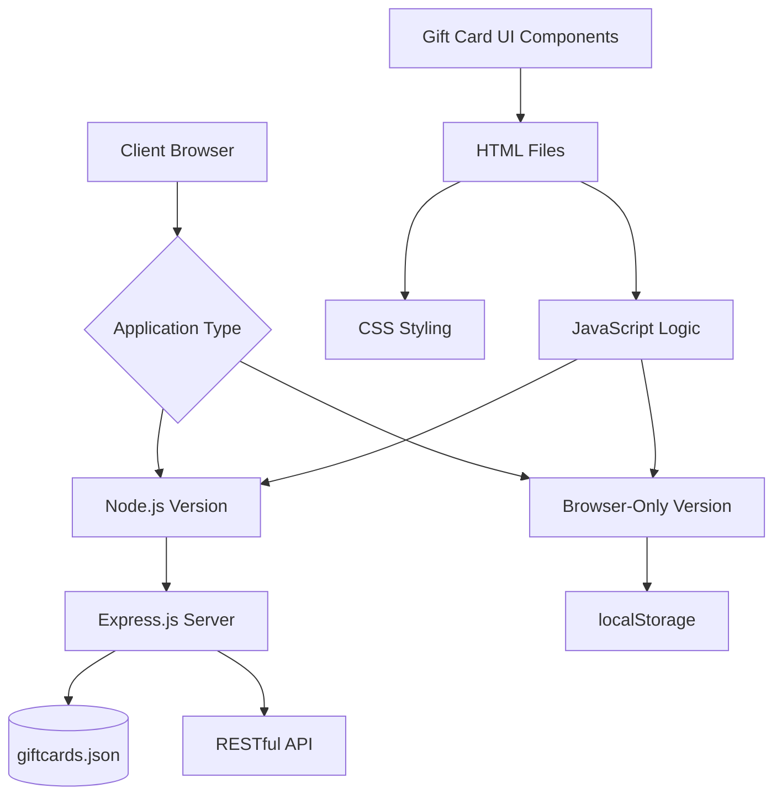
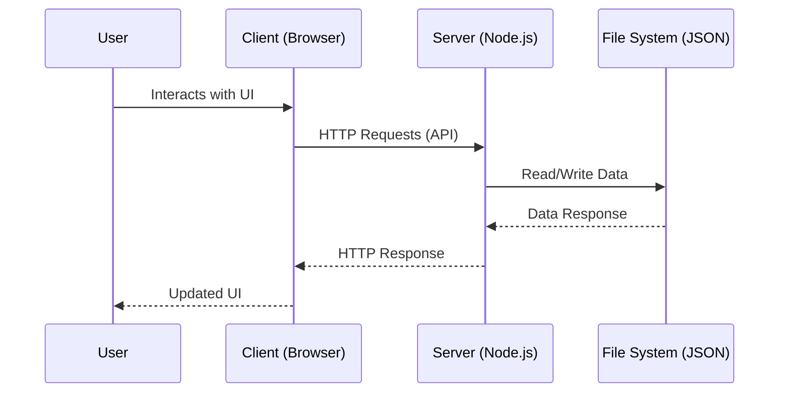
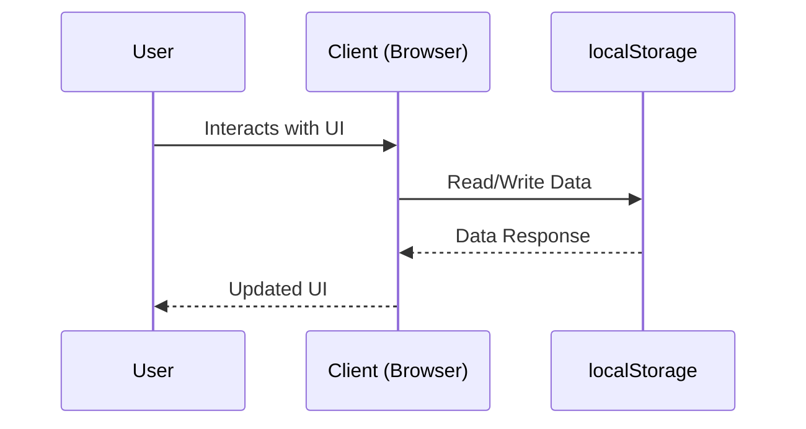

# Gift Card Management System - Architectural Documentation

## 1. System Overview

The Gift Card Management System is a dual-implementation application that allows users to manage digital gift cards for various services. The system provides two distinct approaches:

1. **Node.js Backend Implementation**: A full-featured server-based solution using Express.js with persistent JSON file storage
2. **Browser-Only Implementation**: A client-side solution using localStorage for data persistence

Both implementations share similar UI components and functionality but differ in their data storage and retrieval mechanisms.

## 2. Architecture Diagram



## 3. Components Breakdown

### 3.1 Backend Components (Node.js Version)

#### server.js
- Express.js server implementation
- RESTful API endpoints for CRUD operations
- JSON file-based data persistence
- CORS middleware for cross-origin requests
- Static file serving

#### giftcards.json
- Data storage file for gift card information
- JSON format with giftCards array and nextId counter

#### package.json
- Project metadata and dependencies
- Scripts for starting and development servers
- Express and CORS dependencies

### 3.2 Frontend Components

#### HTML Files
- **gift.html**: Main interface for Node.js version
- **gift-browser.html**: Main interface for browser-only version
- **create.html**: Form for creating new gift cards

#### CSS Files
- **index.css**: Styling for all UI components
- Responsive design for different screen sizes
- Gift card flip animations and visual effects

#### JavaScript Files
- **gift.js**: Client-side logic for Node.js version (API communication)
- **gift-browser.js**: Client-side logic for browser-only version (localStorage)

### 3.3 Shared Components

#### Gift Card UI
- Flip card animation effect
- Front and back sides with different information
- Service-specific imagery
- Interactive elements (Buy, Delete buttons)

## 4. Data Flow

### 4.1 Node.js Version Data Flow


### 4.2 Browser-Only Version Data Flow


## 5. File Structure

```
gift-card-system/
├── server.js                  # Node.js Express server
├── gift.js                    # Frontend JS for Node.js version
├── gift-browser.js            # Frontend JS for browser version
├── gift.html                  # Main HTML for Node.js version
├── gift-browser.html          # Main HTML for browser version
├── create.html                # Gift creation form
├── index.css                  # Shared styling
├── giftcards.json             # Data storage (Node.js version)
├── package.json               # Project dependencies
├── README.md                  # Setup instructions
├── netflix.png                # Service images
├── apple-music.jpg            # Service images
├── spotify.png                # Service images
└── ...                        # Other service images
```

## 6. Technologies Used

- **Backend**: Node.js, Express.js
- **Frontend**: HTML5, CSS3, Vanilla JavaScript
- **Data Storage**: 
  - JSON file (Node.js version)
  - localStorage (Browser-only version)
- **API Communication**: Fetch API
- **UI Features**: CSS Grid, Flexbox, 3D Transforms

## 7. API Endpoints (Node.js Version)

| Method | Endpoint | Description |
|--------|----------|-------------|
| GET | `/api/giftcards` | Retrieve all gift cards |
| GET | `/api/giftcards/:id` | Retrieve specific gift card |
| POST | `/api/giftcards` | Create new gift card |
| PUT | `/api/giftcards/:id` | Update existing gift card |
| DELETE | `/api/giftcards/:id` | Delete gift card |
| GET | `/api/giftcards/search/:term` | Search gift cards |

## 8. UI Components

### 8.1 Gift Card Component
- Flip animation on hover
- Front side: Card details (number, holder, expiry)
- Back side: Value, code, and action buttons
- Service-specific imagery

### 8.2 Navigation Elements
- Create, View, Search links
- Group by Title functionality
- Reset view option

### 8.3 Forms
- Gift card creation form
- Search input field

## 9. Key Features

### 9.1 CRUD Operations
- Create: Add new gift cards with random generation
- Read: Display all gift cards in a responsive grid
- Update: Modify existing gift card information
- Delete: Remove gift cards from the collection

### 9.2 Data Persistence
- **Node.js Version**: Persistent storage in JSON file
- **Browser-Only Version**: localStorage persistence

### 9.3 Search Functionality
- Search by title or code
- Real-time filtering of displayed cards

### 9.4 Responsive Design
- Adapts to different screen sizes
- Mobile-friendly layout
- Touch-compatible interactions

### 9.5 Visual Design
- Animated card flip effect
- Gradient backgrounds
- Service-branded imagery
- Consistent color scheme

## 10. Deployment Options

### 10.1 Node.js Server
- Requires Node.js installation
- Runs on localhost:3000 by default
- Full persistence with JSON file storage

### 10.2 Browser-Only
- No server required
- Opens directly in browser
- Data persists in browser's localStorage

## 11. Security Considerations

- Client-side data storage (both versions)
- No authentication or authorization
- Sample data generation for demonstration
- CORS enabled for local development

## 12. Future Enhancements

- User authentication and accounts
- Database integration (MongoDB, PostgreSQL)
- Admin panel for management
- Payment processing integration
- Email notifications
- Export/import functionality in multiple formats